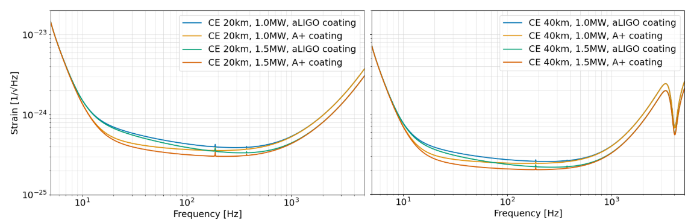

### Source of Noise Curves
---
*Warning*: Certain noise curves may require updates

CE20: [CE-T2000017](https://dcc.cosmicexplorer.org/public/0163/T2000017/007/ce_strain.zip) 
CE40: [CE-T2000017](https://dcc.cosmicexplorer.org/public/0163/T2000017/007/ce_strain.zip)
ET: [ET-GW](http://www.et-gw.eu/index.php/etsensitivities)

The Cosmic Explorer (CE) interferometer design is defined by two independent choices: i) the circulating optical power in the arm cavities--which may be set to either 1 megawatt or 1.5 megawatts, and ii) mirror coating technology--either advanced LIGO (aLIGO) or A+ coating. These choices generate four design cases for both the 20 km and the 40 km CE interferometer. Figure  shows the noise amplitude spectral density (ASD) for these design choices. 

Raising the circulating power from 1 MW to 1.5 MW improves mid- and high-frequency sensitivity (from ~20 Hz to 5000 Hz), but adds extra heat that must be managed. Upgrading the mirrors from aLIGO coating to A+ coating majorly improves low- and mid-band sensitivity (from ~9 Hz to ~600 Hz for CE 20 and to ~400 Hz for CE 40) by reducing coating thermal noise.  Thus, 1.5 MW + A+ coating maximizes sensitivity, whereas the 1 MW + aLIGO pairing minimizes development risk.
